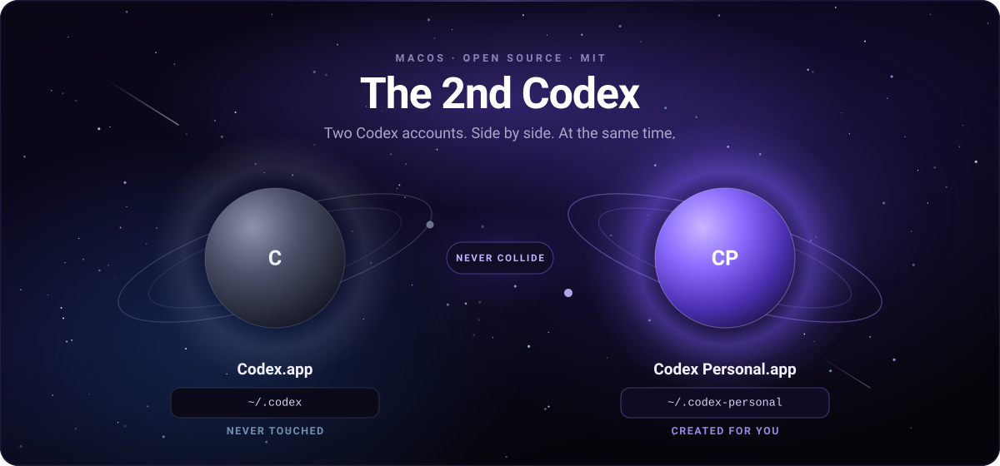

<div align="center">



# Codex the 2nd

[](https://github.com/nutthaphonCh/codex-the-second/actions/workflows/ci.yml)
[](https://github.com/nutthaphonCh/codex-the-second/releases/latest)
[](LICENSE)
[](#building-from-source)

**[Download the DMG →](https://github.com/nutthaphonCh/codex-the-second/releases/latest)**

</div>

---

## The problem

You have a work Codex account and a personal one. Codex Desktop signs into one
at a time. So you sign out. Sign in. Wait for it to reload. Realise you needed
the other one. Sign out again.

## The fix

```
/Applications/Codex.app             →  work account      →  ~/.codex
/Applications/Codex Personal.app    →  personal account  →  ~/.codex-personal
```

Two apps in your Dock. Both open. Both signed in. Neither knows the other
exists.

<div align="center">

| | Codex.app | Codex Personal.app |
|---|---|---|
| **Account** | your usual one | the second one |
| **Runs at the same time?** | ✅ | ✅ |
| **Own login, kept between restarts** | ✅ | ✅ |
| **Own history, settings, sessions** | ✅ | ✅ |
| **Affected when you quit the other** | ❌ never | ❌ never |

</div>

Need a third? [One JSON file](#want-a-third-one) and you have `Codex Work.app`.

---

## Why you can trust it with your setup

**It never touches your existing Codex.** Not the app bundle, not `~/.codex`,
not your config, not your credentials. The launcher's entire job is to pick a
different folder and start the Codex you already have. It will refuse to run —
loudly — if a profile is ever pointed at your real `~/.codex`.

**It's tiny and native.** ~500 lines of Swift, a 976 KB universal binary. No
Electron, no runtime, no daemon, no menu-bar icon, no telemetry. It starts
Codex and exits.

**Nothing of OpenAI's is redistributed.** The DMG contains this launcher and
nothing else. You install Codex Desktop yourself, from OpenAI.

**It separates profiles, not privileges.** This is an isolated *profile*, not a
sandbox. The second Codex runs as the same macOS user with the same permissions
and the same binary; only where it stores its profile changes. It keeps two
accounts out of each other's way — it does not contain either of them.

**It shows its work.** Run `--print-plan` and it prints exactly which Codex it
found and what it would pass to it, without launching anything — and without
ever printing your environment or tokens.

**It's verified, not just compiled.** Process, environment, filesystem and
session isolation were each checked against the real app. See
[docs/verification.md](docs/verification.md).

---

## Install

1. Grab `Codex-the-2nd-vX.Y.Z.dmg` from
   [Releases](https://github.com/nutthaphonCh/codex-the-second/releases/latest)
2. Open it, drag **Codex Personal** into **Applications**
3. Launch it, sign in with your second account

That's it. Your first account carries on exactly as before.

<details>
<summary><b>First launch shows a macOS warning — here's why, and what to do</b></summary>

<br>

Builds are **ad-hoc signed**, not signed with an Apple Developer ID
(that certificate costs money). So macOS says:

> "Codex Personal" cannot be opened because Apple cannot check it for malicious
> software.

**Right-click** the app in Applications → **Open** → confirm. Once. macOS
remembers.

Verify your download first if you like:

```bash
shasum -a 256 -c SHA256SUMS.txt
```

Prefer no warning at all? [Build from source](#building-from-source) — a build
signed on your own machine never prompts.

**Do not disable Gatekeeper system-wide.** You don't need to, and you shouldn't.

If a Developer ID is ever added to this repo's secrets, releases sign, notarize
and staple automatically — no code change, and the warning disappears.

</details>

---

## Command line

`c2nd` ships inside the app. Put it on your PATH once:

```bash
sudo ln -sf "/Applications/Codex Personal.app/Contents/MacOS/c2nd" /usr/local/bin/c2nd
```

```bash
c2nd                    # installed profiles, their folders, running or not
c2nd launch personal    # start a profile
c2nd plan personal      # what would be launched, without launching
c2nd doctor             # check Codex, every profile, and its isolation
```

```
$ c2nd
PROFILE      APP                      CODEX_HOME                      STATE
personal     Codex Personal           ~/.codex-personal               running

$ c2nd doctor
Codex Desktop
  ok   found                     /Applications/ChatGPT.app
  ok   identifier                com.openai.codex
  ok   version                   26.908.40834
...
No problems found.
```

It drives the launchers you have installed — it does not create them, and it
goes through the same validation and isolation checks the app does. `plan` and
`doctor` print only `CODEX_HOME` and `CODEX_ELECTRON_USER_DATA_PATH`, never the
rest of your environment, so their output is safe to paste into an issue.

## Where your data lives

One folder, created on first launch, owner-only (`0700`):

```
~/.codex-personal/
├── config.toml, auth, logs, state, sessions   Codex's own profile data
└── electron-user-data/                        cookies, localStorage,
                                               IndexedDB, session data
```

Nothing is copied from `~/.codex`. No credentials ever move between profiles.

**Uninstalling keeps your data.** Deleting `/Applications/Codex Personal.app`
leaves `~/.codex-personal` alone, so reinstalling puts you right back where you
were. To erase the second profile for real — this signs that account out and
deletes its history, permanently:

```bash
rm -rf ~/.codex-personal
```

Your normal Codex is untouched either way.

---

## Want a third one?

A profile is one JSON file. No Swift to edit.

```bash
cp profiles/work.json.example profiles/work.json
./scripts/build.sh --profile work        # → dist/Codex Work.app
```

```json
{
  "name": "Work",
  "slug": "work",
  "appName": "Codex Work",
  "bundleIdentifier": "io.github.nutthaphonch.codex-the-second.work",
  "codexHome": "~/.codex-work",
  "electronUserDataPath": "~/.codex-work/electron-user-data",
  "icon": { "label": "CW", "tintTop": "#2FB3A5", "tintBottom": "#0C3A36" }
}
```

Each profile gets its own directory, bundle identifier, monogram and colour, so
you can tell them apart in the Dock at a glance.

---

## Building from source

- macOS 13+ to build; the result runs on macOS 12+
- Xcode 15+ or Command Line Tools (`xcode-select --install`)
- Produces a universal binary (Apple Silicon + Intel)
- Running the tests also needs swift-testing — Xcode 16+, or a recent Command
  Line Tools release. Building the app itself does not.

```bash
./scripts/test.sh        # 36 unit tests
./scripts/build.sh       # → dist/Codex Personal.app
./scripts/package.sh     # → dist/*.dmg, *.zip, SHA256SUMS.txt
```

```bash
./scripts/build.sh --profile work        # a different profile
./scripts/build.sh --arch arm64          # skip the universal binary
./scripts/validate-bundle.sh "dist/Codex Personal.app"

# sign with your own certificate instead of ad-hoc
CODESIGN_IDENTITY="Developer ID Application: Your Name (TEAMID)" ./scripts/build.sh
```

---

## How it actually works

On launch, the shim:

1. **Finds Codex** — an explicit override, then the usual install locations,
   then a LaunchServices lookup for `com.openai.codex`. The executable name
   comes from the bundle's `Info.plist` rather than being assumed: Codex Desktop
   currently ships as `ChatGPT.app` with a `ChatGPT` executable, so a hardcoded
   path simply would not work.
2. **Creates the profile directories** (mode `0700`) if missing. Existing data
   is never modified, migrated or reset.
3. **Spawns Codex directly** with `Process`, passing:

   ```
   CODEX_HOME=~/.codex-personal
   CODEX_ELECTRON_USER_DATA_PATH=~/.codex-personal/electron-user-data
   --user-data-dir=~/.codex-personal/electron-user-data
   ```

Two details are what make this work, and both are behaviours of Codex itself:

> **Codex is never launched with `open`.** Going through LaunchServices can hand
> the request to an already-running Codex, which would ignore your profile
> entirely. A direct child process also guarantees the environment is in place
> before Electron initialises.

> **Both environment variables are required.** Codex loads your login shell's
> environment at startup, which would otherwise overwrite `CODEX_HOME` — it
> re-applies the launch-time value only when `CODEX_ELECTRON_USER_DATA_PATH` is
> also set. That same variable makes Codex take a single-instance lock scoped to
> the user-data directory, which is exactly why your two instances never
> collide.

Anything goes wrong — Codex missing, executable unreadable, folder not
creatable, process refusing to start — and you get a native alert that says
what happened. It never fails silently, and you never need a Terminal to find
out why.

---

## Knowledge base

`knowledge/` holds the reasoning behind this project, one fact or procedure per
file: how Codex Desktop is actually packaged, why both environment variables are
required, how the single-instance lock makes coexistence possible, and the
procedures for adding a profile, cutting a release or debugging a launch.

Start at the route table in [knowledge/README.md](knowledge/README.md): find
what you are about to do and it names the entry. If Codex changes and this
stops working, [upstream behaviour watch](knowledge/reference/upstream-behaviour-watch.md)
lists exactly what is being relied on and how each piece fails.

## Limitations

- This relies on how Codex Desktop handles `CODEX_HOME`,
  `CODEX_ELECTRON_USER_DATA_PATH` and `--user-data-dir`. Codex uses these
  itself, but they aren't a public API and a future release could change them.
  If that happens the launcher reports the failure rather than quietly using the
  wrong profile.
- **Codex is looked for in standard locations only** — `/Applications` and
  `~/Applications`, plus a LaunchServices lookup by bundle identifier. There is
  no filesystem-wide search by design. If your Codex lives elsewhere, pin it
  once:

  ```bash
  mkdir -p ~/Library/Application\ Support/CodexTheSecond
  echo "/path/to/Codex.app" > ~/Library/Application\ Support/CodexTheSecond/codex-app-path
  ```

  When several candidates exist the order is fixed and documented, so the choice
  is deterministic rather than whichever was found first. A pinned path that is
  wrong fails loudly instead of falling back.
- **Every release states the Codex Desktop build it was verified against** — in
  the release title and notes, and in [`tested-with.json`](tested-with.json). If
  your Codex is much newer, that is the first thing to check.
- While running, both windows belong to Codex, so they share one Dock icon
  identity. The distinct icon marks the launcher, not the running window.
- macOS only.

---

## What this is not

- ❌ It does **not** include Codex — install Codex Desktop yourself
- ❌ It does **not** modify, patch or redistribute Codex
- ❌ It is **not** affiliated with, endorsed by, or sponsored by OpenAI

Codex is a product of OpenAI. This is an independent utility.

## License

[MIT](LICENSE) — do what you like with it.
